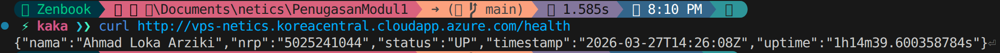

# Penugasan Modul 1 - Open Recruitment NETICS 2026
**Author        :** Ahmad Loka Arziki
**NRP           :** 5025241044
**URL API       :** http://vps-netics.koreacentral.cloudapp.azure.com/health
**Docker Image  :** https://hub.docker.com/r/ahmdlka/api-app

---

## 1. Deskripsi Proyek
Penugasan ini merupakan implementasi CI/CD untuk aplikasi API sederhana (saya memilih golang) yang dideploy menggunakan Docker di VPS publik. Infrastruktur dikelola menggunakan Ansible sebagai konfigurasi manajemen (Reverse Proxy Nginx) dan GitHub Actions untuk otomatisasi deployment.

## 2. Struktur Direktori
Berdasarkan pengembangan, berikut adalah struktur utama repositori ini:
```text
.
├── .github/workflows/
│   └── deploy.yml          # GitHub Actions Workflow
├── media/                  # Media untuk dokumentasi
├── src/
│   ├── ansible/
│   │   ├── install_docker.yml  # Playbook instalasi Docker engine
│   │   ├── inventory.ini       # Daftar host dan variabel VPS
│   │   ├── nginx.config        # Template nginx config
│   │   └── setup_nginx.yml     # Playbook konfigurasi Reverse Proxy
│   ├── .dockerignore       # Ignore file/directory ketika docker build
│   ├── Dockerfile          # Instruksi Build Docker Image
│   ├── go.mod
│   ├── go.sum             
│   └── main.go             # Source code API (Endpoint /health)
└── README.md               
```

## 3. Implementasi API
Aplikasi dibangun menggunakan bahasa **Go** dengan framework gin, alasannya karena syntaxnya mudah dipahami untuk membangun API.
- **Endpoint:** `/health`
- **Output:** JSON berisi Nama, NRP, Status (UP), Timestamp, dan Uptime server.
- **Port Container:** Running pada port `8080`.

### Penjelasan:
Saya membangun sebuah API menggunakan framework gin dari golang. Saya hanya membuat satu endpoint API sesuai dengan kriteria penugasan yaitu:
```
    "nama":      "Ahmad Loka Arziki",
    "nrp":       "5025241044",
    "status":    "UP",
    "timestamp": time.Now().Format(time.RFC3339),
    "uptime":    time.Since(timeStart).String(),
```

**sumber:** 
- https://pkg.go.dev/time#RFC3339 

## 4. Containerization (Docker)
Aplikasi dibungkus menggunakan **Multi-stage Build Dockerfile** untuk menjaga ukuran image tetap kecil dan aman.
- **Base Image Builder:** `golang:1.26.1-alpine`
- **Base Image Runtime:** `alpine:latest`
- **Expose Port:** `8080`

### Penjelasan:
Depedency framework gin sangat berat, oleh karena itu perlu meminimalkan ukuran docker image dengan cara menerapkan multi-stage build dockerfile dimana pada base image pertama hanya digunakan untuk build binary file dari aplikasi yang saya buat, lalu pada base image kedua digunakan untuk runtime dari binary file yang saya buat. Saya menggunakan alpine karena basisnya adalah linux seperti os pada VPS saya, dan saya tidak menggunakan modul atau depedency yang menggunakan bahasa C sehingga penggunaan library musl (bukan glibc) tidak masalah bagi aplikasi API saya.

**sumber:** 
- https://hub.docker.com/_/golang 
- https://medium.com/@mecreate/dockerizing-a-go-application-a-complete-guide-with-best-practices-5648d4eb362c
- https://medium.com/swlh/docker-caching-introduction-to-docker-layers-84f20c48060a


## 5. Configuration Management (Ansible)
Otomasi server dilakukan menggunakan Ansible untuk memastikan *environment* konsisten tanpa konfigurasi manual.
- **install_docker.yml**: Menginstall Docker di VPS dengan Ansible menggunakan modul ansible builtin.
- **setup_nginx.yml**: Menginstal Nginx dan menerapkan template `nginx.config` sebagai Reverse Proxy dari port 80 ke port 8080.
- **Inventory**: Menyimpan host sekaligus menyimpan SSH key-based authentication untuk akses ke VPS.

### Penjelasan:
Pada implementasi Ansible saya membuat dua playbook dengan masing-masing tugas yang berbeda. Pertama adalah playbook untuk menginstall docker di VPS, kedua adalah playbook untuk menginstal sekaligus set-up konfigurasi nginx yang berperan sebagai reverse proxy container API saya.

**sumber:** 
- https://dev.to/lovestaco/install-docker-with-ansible-on-ubuntu-official-repo-docker-compose-578b
- https://dev.to/dpuig/creating-an-ansible-playbook-to-install-and-configure-nginx-for-hosting-static-websites-3n6j
- https://docs.ansible.com/projects/ansible/latest/collections/ansible/builtin/index.html


## 6. CI/CD Pipeline (GitHub Actions)
Alur CI/CD dirancang untuk melakukan otomatisasi setiap kali ada *push* ke branch `main` atau melakukannya manual dari github *workflow_dispatch:*:
1. **Build & Push**: Membuat image Docker dan push image tersebut ke [Docker Hub saya](https://hub.docker.com/r/ahmdlka/api-app).
2. **Deploy**: SSH ke VPS, pull image terbaru (`docker pull`), menghapus container lama, dan menjalankan container baru.
3. **Environment Secrets**: Menggunakan *GitHub Secrets* untuk menyimpan `SSH_HOST`, `SSH_USERNAME`, `SSH_PRIVATE_KEY`, `DOCKER_USERNAME`, dan `DOCKER_PASSWORD`.

### Penjelasan:
Implementasi Github Actions untuk repository ini dilakukan setiap ada push dari main atau saat kita triger secara manual, kemudian hal yang pertama dilakukan adalah memindah seluruh isi repo ke Github Actions Environment, kedua login ke Docker Hub saya, ketiga build image docker menggunakan Dockerfile yang sudah ada dan push image hasil build tadi ke Docker Hub. Terakhir Github Actions melakukan SSH ke VPS saya dengan credential yang sudah saya letakkan di *GitHub Secrets*, kemudian pada VPS saya jalankan command untuk pull image docker dari Docker Hub lalu run docker image di background dengan port host 8080 dan port container juga 8080. Pada implementasi ini saya menggunakan modul dari repository Docker actions dan untuk SSH saya menggunakan repository appleboy ssh-action.

**sumber:** 
- https://github.com/actions/checkout
- https://github.com/docker/login-action
- https://github.com/docker/build-push-action
- https://github.com/appleboy/ssh-action

## 8. Dokumentasi Hasil (Screenshot)
> 

## 9. Sumber tambahan
Pada penugasan kali ini saya juga memanfaatkan AI untuk membantu saya mempelajari materi modul ini sekaligus tempat untuk mencari sumber tambahan, berikut saya sertakan beberapa chat AI yang saya gunakan dalam penugasan ini
- https://gemini.google.com/share/44fd6ac91c7d
- https://chatgpt.com/share/69c694c0-8370-8320-b5d0-a0d8b0fa0302

